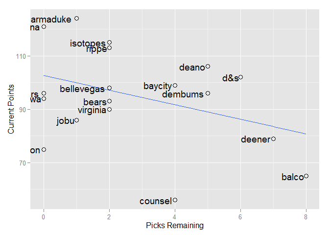

# Fantasy Baseball 2015


#league status

```
##            spent left picks_left dollars_per_pick max_bid
## pasadena     260    0          0              NaN       1
## isotopes     245   15          4             3.75      12
## marmaduke    256    4          2             2.00       3
## rippe        257    3          3             1.00       1
## ottawa       249   11          2             5.50      10
## bellevegas   257    3          3             1.00       1
## d&s          246   14          8             1.75       7
## baycity      230   30          4             7.50      27
## pk dodgers   260    0          0              NaN       1
## jobu         227   33          1            33.00      33
## bears        239   21          3             7.00      19
## virginia     238   22          5             4.40      18
## dembums      239   21          6             3.50      16
## deano        251    9          7             1.29       3
## sturgeon     239   21          0              Inf      22
## deener       234   26         10             2.60      17
## balco        221   39          9             4.33      31
## counsel      227   33          7             4.71      27
```
###Total Dollars Left: **$305**
###Total Picks Left: **74**
###Average Dollars/Pick: **$4.12**

#Current Stats

```
##              R  HR RBI    SB   AVG  ERA WHIP    K SV  W spent left
## pasadena   903 249 910 123.0 0.257 3.63 1.24 1273 37 83   260    0
## isotopes   873 227 876 122.8 0.262 3.70 1.25 1151 64 81   245   15
## marmaduke  938 230 876 151.0 0.259 3.78 1.24 1052 67 69   256    4
## rippe      998 211 870 159.0 0.270 3.86 1.26 1121 60 76   257    3
## ottawa     880 217 862 140.9 0.257 3.80 1.25 1205 66 83   249   11
## bellevegas 921 266 952  95.9 0.258 3.92 1.27 1252 41 82   257    3
## d&s        755 176 740  93.3 0.260 3.42 1.19 1379 54 87   246   14
## baycity    862 220 866 119.0 0.257 3.84 1.26 1212 88 73   230   30
## pk dodgers 741 157 692 145.0 0.257 3.46 1.20 1238 65 87   260    0
## jobu       888 162 745 164.0 0.258 4.12 1.30 1196 68 89   227   33
## bears      830 214 799 129.8 0.253 3.76 1.25 1243 51 79   239   21
## virginia   905 231 883  84.8 0.261 3.93 1.28  836 67 45   238   22
## dembums    818 223 822  96.9 0.267 3.88 1.27 1264 52 58   239   21
## deano      843 219 848 101.0 0.269 3.83 1.28 1155 50 58   251    9
## sturgeon   772 202 788 117.0 0.260 4.07 1.32 1283 42 89   239   21
## deener     731 161 718 126.2 0.261 3.72 1.25 1168 52 65   234   26
## balco      864 194 806 135.9 0.256 4.32 1.37  993 86 25   221   39
## counsel    849 195 788 109.9 0.262 4.15 1.33 1052 46 41   227   33
```

#Hitting Points

```
##            R_pts HR_pts RBI_pts SB_pts AVG_pts total_points
## pasadena      14     17    17.0     10     4.5          125
## isotopes      11     14    14.5      9    14.5          121
## marmaduke     17     15    14.5     16     9.0          120
## rippe         18      8    13.0     17    18.0          114
## ottawa        12     10    11.0     14     4.5          110
## bellevegas    16     18    18.0      3     7.5          102
## d&s            3      4     3.0      2    10.5          101
## baycity        9     12    12.0      8     4.5          100
## pk dodgers     2      1     1.0     15     4.5           97
## jobu          13      3     4.0     18     7.5           94
## bears          6      9     7.0     12     1.0           90
## virginia      15     16    16.0      1    12.5           89
## dembums        5     13     9.0      4    16.0           88
## deano          7     11    10.0      5    17.0           86
## sturgeon       4      7     5.5      7    10.5           80
## deener         1      2     2.0     11    12.5           78
## balco         10      5     8.0     13     2.0           60
## counsel        8      6     5.5      6    14.5           54
```

#Pitching Points

```
##            ERA_pts WHIP_pts K_pts SV_pts W_pts total_points
## pasadena        16       16  16.0    1.0  13.5          125
## isotopes        15       15   6.0   11.0  11.0          121
## marmaduke       12       12   3.5   14.5   7.0          120
## rippe            8        8   5.0   10.0   9.0          114
## ottawa          11       11  10.0   13.0  13.5          110
## bellevegas       6        6  14.0    2.0  12.0          102
## d&s             18       18  18.0    9.0  15.5          101
## baycity          9        9  11.0   18.0   8.0          100
## pk dodgers      17       17  12.0   12.0  15.5           97
## jobu             3        3   9.0   16.0  17.5           94
## bears           13       13  13.0    6.0  10.0           90
## virginia         5        5   1.0   14.5   3.0           89
## dembums          7        7  15.0    7.5   4.5           88
## deano           10       10   7.0    5.0   4.5           86
## sturgeon         4        4  17.0    3.0  17.5           80
## deener          14       14   8.0    7.5   6.0           78
## balco            1        1   2.0   17.0   1.0           60
## counsel          2        2   3.5    4.0   2.0           54
```

#Scatter of Remaining Dollars vs. Current Points
 

#Top 50 Hitter Targets

```
##                  Name    position  AB  R HR SB RBI   AVG dollar_value
## 1        Omar Infante second_base 483 54  7  7  49 0.273         9.11
## 2           Joe Panik second_base 547 56  5  5  47 0.255         7.21
## 3         DJ LeMahieu second_base 488 51  5 14  47 0.279         7.10
## 4       Josh Rutledge second_base 493 56  9  9  50 0.241         6.68
## 5      Everth Cabrera   shortstop 495 60  5 30  38 0.250         6.15
## 6   Andrelton Simmons   shortstop 534 55 11  7  53 0.254         5.39
## 7     Jonathan Schoop second_base 466 52 15  5  53 0.226         3.91
## 8      Danny Espinosa second_base 514 53 13  9  54 0.219         2.87
## 9    Brandon Crawford   shortstop 529 52  9  5  53 0.234        -0.35
## 10        Brad Miller   shortstop 376 47 10  7  42 0.248        -1.52
## 11        Zack Cozart   shortstop 500 48  9  4  48 0.240        -2.33
## 12        Eric Sogard second_base 396 44  4 13  37 0.250        -2.39
## 13       Rickie Weeks second_base 331 42 10  6  38 0.238        -3.32
## 14 Adeiny Hechavarria   shortstop 549 47  4  9  48 0.248        -3.74
## 15     Carlos Sanchez second_base 353 36  3  9  31 0.247        -8.87
## 16       Andy Parrino second_base 376 39  5  4  35 0.224        -9.30
## 17     Gordon Beckham second_base 310 33  6  3  31 0.243       -10.46
## 18   Cliff Pennington second_base 320 33  4  7  29 0.245       -10.92
## 19       Stephen Drew   shortstop 380 40  9  3  40 0.219       -11.02
## 20         Ryan Goins second_base 359 35  3  4  32 0.230       -12.02
## 21       Chris Taylor   shortstop 290 33  3 10  28 0.254       -13.18
## 22  Willie Bloomquist second_base 262 28  2  4  22 0.258       -13.34
## 23      Rafael Furcal second_base 231 27  3  6  20 0.253       -14.40
## 24        Jose Pirela second_base 212 24  5  5  23 0.249       -16.36
## 25     Logan Forsythe second_base 241 27  5  3  25 0.234       -16.38
## 26     Kevin Frandsen second_base 204 21  2  2  20 0.270       -16.58
## 27       Brendan Ryan   shortstop 359 34  3  7  29 0.206       -19.36
## 28        Grant Green second_base 164 18  3  2  18 0.258       -20.07
## 29         Mark Ellis second_base 218 22  2  3  19 0.240       -20.18
## 30  Johnny Giavotella second_base 150 17  2  3  15 0.262       -20.57
## 31    Eduardo Escobar   shortstop 208 22  3  2  21 0.251       -21.42
## 32     Derek Dietrich second_base 153 18  5  1  18 0.239       -22.05
## 33         Nick Punto second_base 204 21  2  4  17 0.226       -22.90
## 34    Marwin Gonzalez   shortstop 211 22  3  4  21 0.240       -22.99
## 35       Hernan Perez second_base 128 14  2  4  12 0.251       -24.28
## 36       Ruben Tejada   shortstop 208 20  2  2  17 0.243       -24.35
## 37      Andrew Romine   shortstop 205 21  2  7  18 0.236       -24.65
## 38    Tommy La Stella second_base  90 10  1  1   9 0.270       -24.76
## 39      Eduardo Nunez   shortstop 143 16  2  5  15 0.258       -25.04
## 40      Nick Franklin second_base 123 15  3  2  13 0.235       -25.49
## 41     Donovan Solano second_base 122 12  1  1  10 0.251       -26.07
## 42   Jonathan Herrera second_base 150 14  1  3  13 0.235       -26.94
## 43      Phil Gosselin second_base 113 11  1  1   9 0.248       -27.21
## 44      Marco Scutaro second_base  66  7  1  1   5 0.265       -27.61
## 45       Clint Barmes   shortstop 237 20  4  2  21 0.212       -28.06
## 46          Dean Anna   shortstop 148 16  2  2  14 0.234       -28.48
## 47  Tyler Pastornicky second_base  85  8  1  2   8 0.248       -29.34
## 48      Brandon Hicks second_base 144 15  5  1  16 0.203       -29.35
## 49       Adam Rosales   shortstop 114 13  3  1  12 0.240       -29.38
## 50       Leury Garcia second_base 151 14  2  8  12 0.215       -29.44
```

#Top 50 Remaining Hitters

```
##                     Name    position  AB  R HR SB RBI   AVG dollar_value
## 1          Michael Bourn    outfield 543 69  5 19  43 0.253        17.70
## 2            Angel Pagan    outfield 504 62  7 18  44 0.273        16.34
## 3          Marcus Semien  third_base 504 65 16  9  61 0.239        16.25
## 4          Luis Valbuena  third_base 499 61 14  3  58 0.239        12.67
## 5                Jon Jay    outfield 475 56  6  8  47 0.278        12.43
## 6         Mike Moustakas  third_base 478 57 17  3  61 0.248        12.23
## 7        Shane Victorino    outfield 395 56 10 11  48 0.266        12.19
## 8         Trevor Plouffe  third_base 462 57 16  2  60 0.248        11.86
## 9              Adam Lind  first_base 470 61 19  1  68 0.272        11.63
## 10           Carlos Ruiz     catcher 386 41  8  4  41 0.260        10.46
## 11        Matt Dominguez  third_base 519 57 18  1  63 0.230        10.02
## 12          Omar Infante second_base 483 54  7  7  49 0.273         9.11
## 13         David DeJesus    outfield 441 56  9  6  44 0.238         7.80
## 14       Kendrys Morales          dh 479 59 16  1  66 0.263         7.58
## 15             Joe Panik second_base 547 56  5  5  47 0.255         7.21
## 16           DJ LeMahieu second_base 488 51  5 14  47 0.279         7.10
## 17            B.J. Upton    outfield 493 56 15 17  51 0.215         6.72
## 18         Josh Rutledge second_base 493 56  9  9  50 0.241         6.68
## 19         Gregor Blanco    outfield 484 54  5 17  43 0.249         6.49
## 20       Conor Gillaspie  third_base 441 51 11  2  52 0.252         6.33
## 21        Everth Cabrera   shortstop 495 60  5 30  38 0.250         6.15
## 22         Wilmer Flores  third_base 477 49 15  2  56 0.248         5.82
## 23        Ender Inciarte    outfield 467 52  5 19  35 0.254         5.78
## 24           Chris Young    outfield 407 52 15 10  51 0.228         5.75
## 25             Ike Davis  first_base 430 60 17  3  59 0.239         5.45
## 26     Andrelton Simmons   shortstop 534 55 11  7  53 0.254         5.39
## 27      Alberto Callaspo  third_base 507 51  9  3  51 0.250         5.31
## 28           Rene Rivera     catcher 366 39  9  1  41 0.231         5.24
## 29          Kevin Pillar    outfield 399 47  8 14  47 0.266         5.06
## 30         Jose Iglesias  third_base 465 51  5 12  45 0.257         4.83
## 31       Jonathan Schoop second_base 466 52 15  5  53 0.226         3.91
## 32        Danny Espinosa second_base 514 53 13  9  54 0.219         2.87
## 33 Christian Bethancourt     catcher 407 34  9  6  41 0.238         2.70
## 34              Sam Fuld    outfield 452 52  5 18  42 0.232         2.63
## 35            Jacob Lamb  third_base 420 45 12  3  49 0.250         2.16
## 36        Grady Sizemore    outfield 447 47 10  7  45 0.239         1.93
## 37        Dioner Navarro     catcher 235 28  7  1  30 0.263         1.29
## 38           Ryan Doumit     catcher 294 32  9  2  35 0.237         1.14
## 39           Brayan Pena     catcher 325 30  5  3  32 0.250         0.11
## 40      Brandon Crawford   shortstop 529 52  9  5  53 0.234        -0.35
## 41          Justin Smoak  first_base 387 52 16  1  54 0.240        -0.46
## 42        J.P. Arencibia     catcher 314 33 13  1  40 0.209        -0.69
## 43          Nick Swisher  first_base 415 53 14  1  50 0.234        -1.35
## 44           Brad Miller   shortstop 376 47 10  7  42 0.248        -1.52
## 45           Daniel Nava    outfield 285 38  6  3  33 0.265        -2.20
## 46           Zack Cozart   shortstop 500 48  9  4  48 0.240        -2.33
## 47         Freddy Galvis  third_base 484 44 11  5  48 0.226        -2.36
## 48           Eric Sogard second_base 396 44  4 13  37 0.250        -2.39
## 49         Ichiro Suzuki    outfield 381 38  4 12  34 0.267        -2.66
## 50        Mitch Moreland  first_base 384 48 15  2  51 0.244        -3.09
```

#Top 50 Remaining Pitchers

```
##                   Name  IP  ERA WHIP  W SV   K dollar_value
## 56         CC Sabathia 192 3.94 1.25 11  0 151         9.35
## 66       Huston Street  65 3.52 1.20  3 35  56         8.93
## 73       Tony Cingrani 163 3.72 1.29 10  0 170         8.63
## 96        Jason Vargas 182 4.11 1.28 11  0 121         5.79
## 97          Tim Hudson 182 3.92 1.28 10  0 117         5.68
## 101          J.A. Happ 163 4.01 1.30 10  0 138         5.47
## 102       Tim Lincecum 169 4.01 1.30  9  0 147         5.42
## 107      Bartolo Colon 173 4.16 1.23  9  0 120         5.13
## 110         Wade Miley 173 4.21 1.35 12  0 133         4.77
## 111  Jeremy Hellickson 173 4.15 1.28  9  0 135         4.77
## 117         Matt Moore 163 4.04 1.35 10  0 144         4.51
## 118      Shelby Miller 173 4.15 1.33  9  0 152         4.48
## 123     LaTroy Hawkins  65 3.96 1.29  3 28  47         4.13
## 126       Vance Worley 163 4.07 1.29 10  0 111         3.95
## 127       Roenis Elias 153 4.04 1.33 10  0 129         3.93
## 129      Drew Pomeranz 163 4.13 1.36 10  0 141         3.76
## 131       James Paxton 173 4.14 1.37 10  0 143         3.72
## 132    Josh Collmenter 188 4.38 1.32 10  0 132         3.56
## 136       Mark Buehrle 189 4.45 1.34 12  0 115         3.16
## 137         Vidal Nuno 144 4.01 1.27  8  0 116         2.96
## 138   Jorge de la Rosa 192 4.48 1.40 11  0 148         2.55
## 140     Nathan Eovaldi 173 4.43 1.33 10  0 120         2.22
## 141   Justin Masterson 173 4.25 1.43 11  0 133         1.91
## 142    Hector Santiago 145 4.07 1.36  9  0 120         1.83
## 143     Yusmeiro Petit  88 3.05 1.09  5  0  86         1.79
## 144      Ricky Nolasco 173 4.56 1.33 10  0 121         1.74
## 148     Ryan Vogelsong 163 4.44 1.35  9  0 124         1.12
## 152     Kyle Hendricks 134 4.14 1.29  8  0  95         0.68
## 153        Travis Wood 153 4.35 1.37  9  0 119         0.65
## 154     Chase Anderson 125 4.06 1.29  7  0 106         0.62
## 155      Jim Henderson  65 3.25 1.18  3  9  73         0.24
## 156        Kris Medlen 112 3.85 1.24  7  0  79         0.13
## 158    Randall Delgado 103 3.80 1.27  6  1  94         0.00
## 160      Trevor Cahill 153 4.27 1.40  8  0 125        -0.09
## 162 Anthony DeSclafani 144 4.47 1.31  7  0 112        -0.38
## 163      Tsuyoshi Wada  93 3.54 1.22  5  1  83        -0.42
## 164        Colby Lewis 153 4.67 1.35  9  0 112        -0.47
## 166         Will Smith  74 3.14 1.18  4  2  83        -0.51
## 167       Jason Grilli  65 2.67 1.11  3  3  74        -0.52
## 170  Hunter Strickland  55 2.48 1.06  3  4  61        -1.06
## 171          Ivan Nova 115 4.16 1.30  7  0  88        -1.10
## 173     Brandon Maurer  84 3.67 1.25  4  4  78        -1.28
## 174   Chad Billingsley 125 4.32 1.34  7  0  95        -1.68
## 175     Junichi Tazawa  65 3.08 1.15  4  2  64        -1.78
## 176       Darren O'Day  65 3.12 1.14  4  2  63        -1.81
## 177      Scott Feldman 189 4.94 1.40 10  0 119        -1.87
## 178     Brett Anderson  96 3.72 1.30  6  0  76        -1.88
## 179          Mike Dunn  65 2.96 1.19  3  3  71        -1.89
## 180     Marco Gonzales  93 3.61 1.28  5  0  78        -2.06
## 182  Brett Oberholtzer 153 4.73 1.36  8  0 103        -2.12
```
