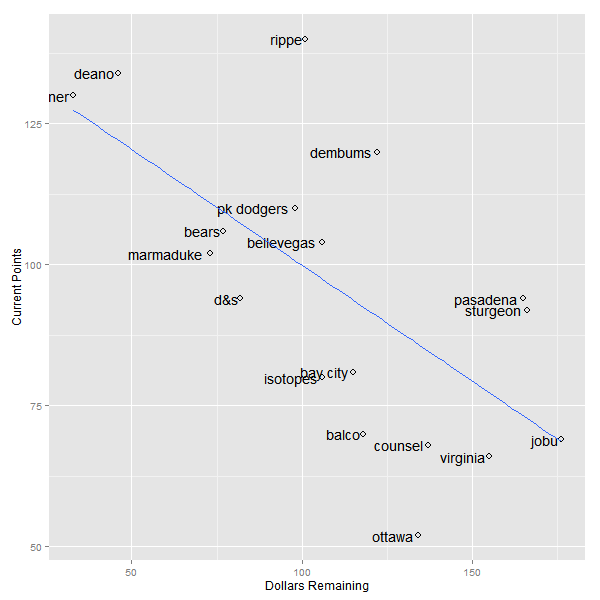

Current Stats
=============

    ##              R  HR RBI  SB   AVG  ERA WHIP    K SV  W spent left
    ## rippe      741 164 638 131 0.277 3.25 1.17  311 60 18   172   88
    ## deano      551 162 575  46 0.276 3.33 1.18  648 34 42   214   46
    ## deener     443 100 432  89 0.268 3.06 1.12  589 35 39   227   33
    ## pk dodgers 489  99 426 122 0.256 3.51 1.20 1184 30 84   194   66
    ## dembums    466 135 463  66 0.279 3.53 1.17  715  0 48   138  122
    ## sturgeon   433 113 445  59 0.260 3.15 1.15  345 41 20   126  134
    ## bellevegas 405 131 435  53 0.260 3.76 1.24  942 33 72   164   96
    ## marmaduke  714 192 674 114 0.260 3.81 1.25  321 30 22   187   73
    ## bears      418 126 418  55 0.255 3.65 1.22  885 33 59   183   77
    ## d&s        225  52 209  28 0.267 3.32 1.17 1133  9 79   178   82
    ## pasadena   422 133 443  74 0.253 3.66 1.24  597  0 42    95  165
    ## isotopes   358  94 354  56 0.271 3.78 1.27  642 31 48   165   95
    ## bay city   339  97 362  38 0.261 3.72 1.24  730 25 50   145  115
    ## balco      495 118 480  69 0.265 4.19 1.32  155  0 12   142  118
    ## virginia   130  25 114  16 0.273 3.38 1.18  484 31 32   105  155
    ## jobu       213  28 163  40 0.265 4.14 1.30  866 34 64    84  176
    ## counsel    365  83 326  65 0.268 3.95 1.27  556  0 38   123  137
    ## ottawa     328  89 324  77 0.260 3.99 1.26  428  0 31   151  109

Hitting Points
==============

    ##            R_pts HR_pts RBI_pts SB_pts AVG_pts total_points
    ## rippe         18     17      17     18    17.0          141
    ## deano         16     16      16      5    16.0          132
    ## deener        12      9      10     15    12.5          126
    ## pk dodgers    14      8       9     17     3.0          120
    ## dembums       13     15      14     11    18.0          120
    ## sturgeon      11     10      13      9     5.5          106
    ## bellevegas     8     13      11      6     5.5          102
    ## marmaduke     17     18      18     16     5.5          100
    ## bears          9     12       8      7     2.0          100
    ## d&s            3      3       3      2    11.0           92
    ## pasadena      10     14      12     13     1.0           90
    ## isotopes       6      6       6      8    14.0           84
    ## bay city       5      7       7      3     8.0           79
    ## balco         15     11      15     12     9.5           70
    ## virginia       1      1       1      1    15.0           68
    ## jobu           2      2       2      4     9.5           67
    ## counsel        7      4       5     10    12.5           64
    ## ottawa         4      5       4     14     5.5           52

Pitching Points
===============

    ##            ERA_pts WHIP_pts K_pts SV_pts W_pts total_points
    ## rippe           16       16     2   18.0   2.0          141
    ## deano           14       14    11   14.5   9.5          132
    ## deener          18       18     8   16.0   8.0          126
    ## pk dodgers      12       12    18    8.5  18.0          120
    ## dembums         11       11    12    3.0  11.5          120
    ## sturgeon        17       17     4   17.0   3.0          106
    ## bellevegas       7        7    16   12.5  16.0          102
    ## marmaduke        5        5     3    8.5   4.0          100
    ## bears           10       10    15   12.5  14.0          100
    ## d&s             15       15    17    6.0  17.0           92
    ## pasadena         9        9     9    3.0   9.5           90
    ## isotopes         6        6    10   10.5  11.5           84
    ## bay city         8        8    13    7.0  13.0           79
    ## balco            1        1     1    3.0   1.0           70
    ## virginia        13       13     6   10.5   6.0           68
    ## jobu             2        2    14   14.5  15.0           67
    ## counsel          4        4     7    3.0   7.0           64
    ## ottawa           3        3     5    3.0   5.0           52

Scatter of Remaining Dollars vs. Current Points
===============================================

    ## pdf 
    ##   2

