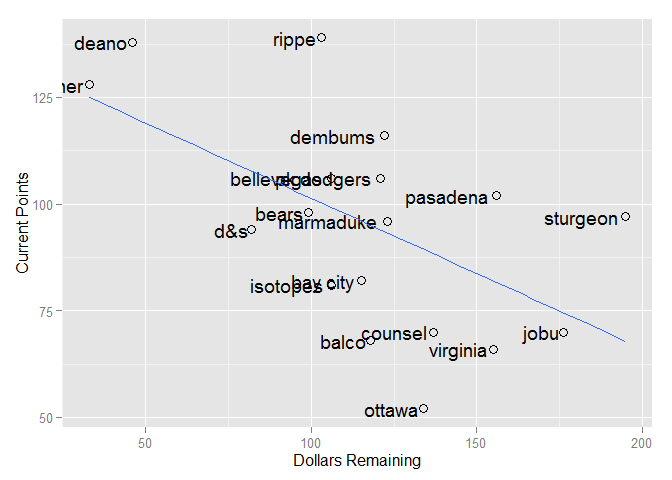

Current Stats
=============

    ##              R  HR RBI  SB   AVG  ERA WHIP    K SV  W spent left
    ## rippe      622 141 526 110 0.283 3.25 1.17  311 60 18   157  103
    ## deano      551 162 575  46 0.276 3.33 1.18  648 34 42   214   46
    ## deener     443 100 432  89 0.268 3.06 1.12  589 35 39   227   33
    ## dembums    466 135 463  66 0.279 3.53 1.17  715  0 48   138  122
    ## pk dodgers 331  69 291  94 0.264 3.37 1.18  892 30 61   139  121
    ## bellevegas 405 131 435  53 0.260 3.71 1.23  810 33 59   154  106
    ## pasadena   497 154 521  81 0.254 3.66 1.24  597  0 42   104  156
    ## bears      339 106 348  51 0.251 3.65 1.22  885 33 59   161   99
    ## sturgeon   355  87 358  55 0.258 3.15 1.15  344 41 20    65  195
    ## marmaduke  551 156 535  99 0.257 3.81 1.25  321 30 22   137  123
    ## d&s        225  52 209  28 0.267 3.32 1.17 1133  9 79   178   82
    ## bay city   339  97 362  38 0.261 3.72 1.24  730 25 50   145  115
    ## isotopes   292  86 295  41 0.271 3.78 1.27  642 31 48   154  106
    ## jobu       213  28 163  40 0.265 4.14 1.30  866 34 64    84  176
    ## counsel    365  83 326  65 0.268 3.95 1.27  556  0 38   123  137
    ## balco      495 118 480  69 0.265 4.19 1.32  155  0 12   142  118
    ## virginia   130  25 114  16 0.273 3.38 1.18  484 31 32   105  155
    ## ottawa     280  71 270  73 0.262 3.99 1.26  428  0 31   126  134

Hitting Points
==============

    ##            R_pts HR_pts RBI_pts SB_pts AVG_pts total_points
    ## rippe       18.0     15      16     18    18.0          139
    ## deano       16.5     18      18      6    16.0          138
    ## deener      12.0     10      11     15    12.5          128
    ## dembums     13.0     14      13     11    17.0          116
    ## pk dodgers   6.0      4       5     16     8.0          106
    ## bellevegas  11.0     13      12      8     5.0          106
    ## pasadena    15.0     16      15     14     2.0          102
    ## bears        7.5     11       8      7     1.0           98
    ## sturgeon     9.0      8       9      9     4.0           97
    ## marmaduke   16.5     17      17     17     3.0           96
    ## d&s          3.0      3       3      2    11.0           94
    ## bay city     7.5      9      10      3     6.0           82
    ## isotopes     5.0      7       6      5    14.0           81
    ## jobu         2.0      2       2      4     9.5           70
    ## counsel     10.0      6       7     10    12.5           70
    ## balco       14.0     12      14     12     9.5           68
    ## virginia     1.0      1       1      1    15.0           66
    ## ottawa       4.0      5       4     13     7.0           52

Pitching Points
===============

    ##            ERA_pts WHIP_pts K_pts SV_pts W_pts total_points
    ## rippe           16       16     2   18.0   2.0          139
    ## deano           14       14    11   14.5   9.5          138
    ## deener          18       18     8   16.0   8.0          128
    ## dembums         11       11    12    3.0  11.5          116
    ## pk dodgers      13       13    17    8.5  16.0          106
    ## bellevegas       8        8    14   12.5  14.5          106
    ## pasadena         9        9     9    3.0   9.5          102
    ## bears           10       10    16   12.5  14.5           98
    ## sturgeon        17       17     4   17.0   3.0           97
    ## marmaduke        5        5     3    8.5   4.0           96
    ## d&s             15       15    18    6.0  18.0           94
    ## bay city         7        7    13    7.0  13.0           82
    ## isotopes         6        6    10   10.5  11.5           81
    ## jobu             2        2    15   14.5  17.0           70
    ## counsel          4        4     7    3.0   7.0           70
    ## balco            1        1     1    3.0   1.0           68
    ## virginia        12       12     6   10.5   6.0           66
    ## ottawa           3        3     5    3.0   5.0           52

Scatter of Current Draft
========================

