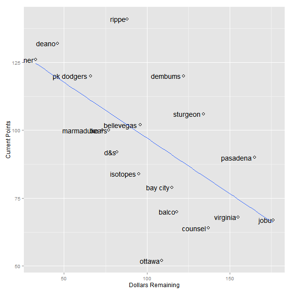

Current Stats
=============

    ##              R  HR RBI  SB   AVG  ERA WHIP    K SV  W spent left
    ## rippe      676 150 576 124 0.280 3.25 1.17  311 60 18   159  101
    ## deano      551 162 575  46 0.276 3.33 1.18  648 34 42   214   46
    ## deener     443 100 432  89 0.268 3.06 1.12  589 35 39   227   33
    ## dembums    466 135 463  66 0.279 3.53 1.17  715  0 48   138  122
    ## pk dodgers 373  81 333  97 0.260 3.38 1.17 1023 30 72   162   98
    ## bears      418 126 418  55 0.255 3.65 1.22  885 33 59   183   77
    ## bellevegas 405 131 435  53 0.260 3.71 1.23  810 33 59   154  106
    ## marmaduke  714 192 674 114 0.260 3.81 1.25  321 30 22   187   73
    ## d&s        225  52 209  28 0.267 3.32 1.17 1133  9 79   178   82
    ## pasadena   422 133 443  74 0.253 3.66 1.24  597  0 42    95  165
    ## sturgeon   355  87 358  55 0.258 3.15 1.15  345 41 20    94  166
    ## bay city   339  97 362  38 0.261 3.72 1.24  730 25 50   145  115
    ## isotopes   292  86 295  41 0.271 3.78 1.27  642 31 48   154  106
    ## balco      495 118 480  69 0.265 4.19 1.32  155  0 12   142  118
    ## jobu       213  28 163  40 0.265 4.14 1.30  866 34 64    84  176
    ## counsel    365  83 326  65 0.268 3.95 1.27  556  0 38   123  137
    ## virginia   130  25 114  16 0.273 3.38 1.18  484 31 32   105  155
    ## ottawa     280  71 270  73 0.262 3.99 1.26  428  0 31   126  134

Hitting Points
==============

    ##            R_pts HR_pts RBI_pts SB_pts AVG_pts total_points
    ## rippe         17     16      17   18.0    18.0          140
    ## deano         16     17      16    6.0    16.0          134
    ## deener        13     10      11   15.0    12.5          130
    ## dembums       14     15      14   11.0    17.0          120
    ## pk dodgers     9      5       7   16.0     5.0          110
    ## bears         11     12      10    8.5     2.0          106
    ## bellevegas    10     13      12    7.0     5.0          104
    ## marmaduke     18     18      18   17.0     5.0          102
    ## d&s            3      3       3    2.0    11.0           94
    ## pasadena      12     14      13   14.0     1.0           94
    ## sturgeon       7      8       8    8.5     3.0           92
    ## bay city       6      9       9    3.0     7.0           81
    ## isotopes       5      7       5    5.0    14.0           80
    ## balco         15     11      15   12.0     9.5           70
    ## jobu           2      2       2    4.0     9.5           69
    ## counsel        8      6       6   10.0    12.5           68
    ## virginia       1      1       1    1.0    15.0           66
    ## ottawa         4      4       4   13.0     8.0           52

Pitching Points
===============

    ##            ERA_pts WHIP_pts K_pts SV_pts W_pts total_points
    ## rippe         16.0     16.0     2   18.0   2.0          140
    ## deano         14.0     14.0    11   14.5   9.5          134
    ## deener        18.0     18.0     8   16.0   8.0          130
    ## dembums       11.0     11.0    12    3.0  11.5          120
    ## pk dodgers    12.5     12.5    17    8.5  17.0          110
    ## bears         10.0     10.0    16   12.5  14.5          106
    ## bellevegas     8.0      8.0    14   12.5  14.5          104
    ## marmaduke      5.0      5.0     3    8.5   4.0          102
    ## d&s           15.0     15.0    18    6.0  18.0           94
    ## pasadena       9.0      9.0     9    3.0   9.5           94
    ## sturgeon      17.0     17.0     4   17.0   3.0           92
    ## bay city       7.0      7.0    13    7.0  13.0           81
    ## isotopes       6.0      6.0    10   10.5  11.5           80
    ## balco          1.0      1.0     1    3.0   1.0           70
    ## jobu           2.0      2.0    15   14.5  16.0           69
    ## counsel        4.0      4.0     7    3.0   7.0           68
    ## virginia      12.5     12.5     6   10.5   6.0           66
    ## ottawa         3.0      3.0     5    3.0   5.0           52

Scatter of Remaining Dollars vs. Current Points
===============================================

    ## pdf 
    ##   2

