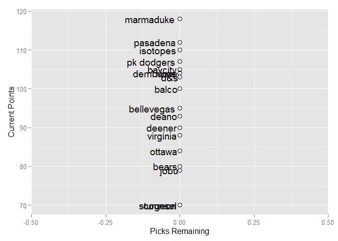

# Fantasy Baseball 2015


#league status

```
##            spent left picks_left dollars_per_pick max_bid
## rippe        257    3          3             1.00       1
## isotopes     243   17          5             3.40      13
## pasadena     255    5          2             2.50       4
## marmaduke    253    7          3             2.33       5
## bellevegas   255    5          4             1.25       2
## dembums      222   38         10             3.80      29
## d&s          225   35         11             3.18      25
## bears        232   28          4             7.00      25
## deano        251    9          7             1.29       3
## pk dodgers   260    0          0              NaN       1
## jobu         241   19          3             6.33      17
## ottawa       231   29          5             5.80      25
## baycity      197   63          7             9.00      57
## deener       232   28         12             2.33      17
## virginia     220   40          9             4.44      32
## sturgeon     220   40          3            13.33      38
## balco        221   39          9             4.33      31
## counsel      176   84         12             7.00      73
```
###Total Dollars Left: **$489**
###Total Picks Left: **109**
###Average Dollars/Pick: **$4.49**

#Current Stats

```
##              R  HR RBI    SB   AVG  ERA WHIP    K SV  W spent left
## rippe      998 211 870 159.0 0.270 3.86 1.26 1121 60 76   257    3
## isotopes   873 227 876 122.8 0.262 3.78 1.27 1109 68 72   243   17
## pasadena   903 249 910 123.0 0.257 3.81 1.28 1363 39 79   255    5
## marmaduke  938 230 876 151.0 0.259 3.88 1.26 1012 71 59   253    7
## bellevegas 899 260 932  95.1 0.259 3.92 1.27 1252 41 82   255    5
## dembums    832 220 834 102.1 0.267 3.88 1.27 1264 52 58   222   38
## d&s        760 167 734 101.2 0.261 3.57 1.22 1393 51 84   225   35
## bears      825 207 783 133.7 0.253 3.76 1.25 1243 51 79   232   28
## deano      843 219 848 101.0 0.269 3.83 1.28 1155 50 58   251    9
## pk dodgers 741 157 692 145.0 0.257 3.46 1.20 1238 65 87   260    0
## jobu       928 185 803 148.0 0.257 4.12 1.30 1196 68 89   241   19
## ottawa     858 209 838 139.8 0.257 3.91 1.27 1240 50 73   231   29
## baycity    784 201 802  99.8 0.258 3.84 1.26 1212 88 73   197   63
## deener     731 161 718 126.2 0.261 3.86 1.28 1200 55 54   232   28
## virginia   830 216 821  83.6 0.260 4.00 1.30  938 71 46   220   40
## sturgeon   762 201 776 104.9 0.261 4.01 1.31 1201 49 73   220   40
## balco      864 194 806 135.9 0.256 4.32 1.37  993 86 25   221   39
## counsel    775 178 727 114.6 0.261 4.21 1.34 1095 24 39   176   84
```

#Hitting Points

```
##            R_pts HR_pts RBI_pts SB_pts AVG_pts total_points
## rippe         18   11.0    14.0     18    18.0          129
## isotopes      13   15.0    15.5      9    15.0          124
## pasadena      15   17.0    17.0     10     4.5          124
## marmaduke     17   16.0    15.5     17     8.5          116
## bellevegas    14   18.0    18.0      2     8.5          106
## dembums        9   14.0    11.0      6    16.0          104
## d&s            3    3.0     4.0      5    12.5          103
## bears          7    9.0     6.0     12     1.0          102
## deano         10   13.0    13.0      4    17.0          101
## pk dodgers     2    1.0     1.0     15     4.5          100
## jobu          16    5.0     8.0     16     4.5           95
## ottawa        11   10.0    12.0     14     4.5           94
## baycity        6    7.5     7.0      3     7.0           94
## deener         1    2.0     2.0     11    12.5           72
## virginia       8   12.0    10.0      1    10.0           70
## sturgeon       4    7.5     5.0      7    12.5           68
## balco         12    6.0     9.0     13     2.0           64
## counsel        5    4.0     3.0      8    12.5           44
```

#Pitching Points

```
##            ERA_pts WHIP_pts K_pts SV_pts W_pts total_points
## rippe         10.5     10.5     6   11.0  12.0          129
## isotopes      15.0     15.0     5   13.5   8.0          124
## pasadena      14.0     14.0    17    2.0  13.5          124
## marmaduke      8.5      8.5     3   15.5   7.0          116
## bellevegas     6.0      6.0    15    3.0  15.0          106
## dembums        8.5      8.5    16    9.0   5.5          104
## d&s           17.0     17.0    18    7.5  16.0          103
## bears         16.0     16.0    14    7.5  13.5          102
## deano         13.0     13.0     7    5.5   5.5          101
## pk dodgers    18.0     18.0    12   12.0  17.0          100
## jobu           3.0      3.0     8   13.5  18.0           95
## ottawa         7.0      7.0    13    5.5  10.0           94
## baycity       12.0     12.0    11   18.0  10.0           94
## deener        10.5     10.5     9   10.0   4.0           72
## virginia       5.0      5.0     1   15.5   3.0           70
## sturgeon       4.0      4.0    10    4.0  10.0           68
## balco          1.0      1.0     2   17.0   1.0           64
## counsel        2.0      2.0     4    1.0   2.0           44
```

#Scatter of Remaining Dollars vs. Current Points
 

#Top 50 Hitter Targets

```
##                  Name    position  AB  R HR SB RBI   AVG dollar_value
## 1          Jed Lowrie   shortstop 502 61 12  1  58 0.258        10.59
## 2      Jhonny Peralta   shortstop 514 59 15  3  64 0.256         9.99
## 3        Omar Infante second_base 483 54  7  7  49 0.273         9.11
## 4           Joe Panik second_base 547 56  5  5  47 0.255         7.21
## 5         DJ LeMahieu second_base 488 51  5 14  47 0.279         7.10
## 6       Josh Rutledge second_base 493 56  9  9  50 0.241         6.68
## 7      Everth Cabrera   shortstop 495 60  5 30  38 0.250         6.15
## 8   Andrelton Simmons   shortstop 534 55 11  7  53 0.254         5.39
## 9     Jonathan Schoop second_base 466 52 15  5  53 0.226         3.91
## 10     Danny Espinosa second_base 514 53 13  9  54 0.219         2.87
## 11   Brandon Crawford   shortstop 529 52  9  5  53 0.234        -0.35
## 12        Brad Miller   shortstop 376 47 10  7  42 0.248        -1.52
## 13       Jose Ramirez   shortstop 426 48  5 20  40 0.252        -2.08
## 14        Zack Cozart   shortstop 500 48  9  4  48 0.240        -2.33
## 15        Eric Sogard second_base 396 44  4 13  37 0.250        -2.39
## 16       Rickie Weeks second_base 331 42 10  6  38 0.238        -3.32
## 17 Adeiny Hechavarria   shortstop 549 47  4  9  48 0.248        -3.74
## 18     Carlos Sanchez second_base 353 36  3  9  31 0.247        -8.87
## 19       Andy Parrino second_base 376 39  5  4  35 0.224        -9.30
## 20     Gordon Beckham second_base 310 33  6  3  31 0.243       -10.46
## 21   Cliff Pennington second_base 320 33  4  7  29 0.245       -10.92
## 22       Stephen Drew   shortstop 380 40  9  3  40 0.219       -11.02
## 23         Ryan Goins second_base 359 35  3  4  32 0.230       -12.02
## 24   Jurickson Profar second_base 234 30  6  5  27 0.246       -12.16
## 25       Chris Taylor   shortstop 290 33  3 10  28 0.254       -13.18
## 26  Willie Bloomquist second_base 262 28  2  4  22 0.258       -13.34
## 27      Rafael Furcal second_base 231 27  3  6  20 0.253       -14.40
## 28        Jose Pirela second_base 212 24  5  5  23 0.249       -16.36
## 29     Logan Forsythe second_base 241 27  5  3  25 0.234       -16.38
## 30     Kevin Frandsen second_base 204 21  2  2  20 0.270       -16.58
## 31       Brendan Ryan   shortstop 359 34  3  7  29 0.206       -19.36
## 32        Grant Green second_base 164 18  3  2  18 0.258       -20.07
## 33         Mark Ellis second_base 218 22  2  3  19 0.240       -20.18
## 34  Johnny Giavotella second_base 150 17  2  3  15 0.262       -20.57
## 35    Eduardo Escobar   shortstop 208 22  3  2  21 0.251       -21.42
## 36     Derek Dietrich second_base 153 18  5  1  18 0.239       -22.05
## 37         Nick Punto second_base 204 21  2  4  17 0.226       -22.90
## 38    Marwin Gonzalez   shortstop 211 22  3  4  21 0.240       -22.99
## 39       Hernan Perez second_base 128 14  2  4  12 0.251       -24.28
## 40       Ruben Tejada   shortstop 208 20  2  2  17 0.243       -24.35
## 41      Andrew Romine   shortstop 205 21  2  7  18 0.236       -24.65
## 42    Tommy La Stella second_base  90 10  1  1   9 0.270       -24.76
## 43      Eduardo Nunez   shortstop 143 16  2  5  15 0.258       -25.04
## 44      Nick Franklin second_base 123 15  3  2  13 0.235       -25.49
## 45     Donovan Solano second_base 122 12  1  1  10 0.251       -26.07
## 46   Jonathan Herrera second_base 150 14  1  3  13 0.235       -26.94
## 47      Phil Gosselin second_base 113 11  1  1   9 0.248       -27.21
## 48      Marco Scutaro second_base  66  7  1  1   5 0.265       -27.61
## 49       Clint Barmes   shortstop 237 20  4  2  21 0.212       -28.06
## 50          Dean Anna   shortstop 148 16  2  2  14 0.234       -28.48
```

#Top 50 Remaining Hitters

```
##                     Name    position  AB  R HR SB RBI   AVG dollar_value
## 1       Desmond Jennings    outfield 552 75 14 19  55 0.241        23.57
## 2              Nori Aoki    outfield 531 70  6 18  44 0.279        22.51
## 3          Dustin Ackley    outfield 531 67 13  8  59 0.252        19.10
## 4          Michael Bourn    outfield 543 69  5 19  43 0.253        17.70
## 5       Alejandro De Aza    outfield 473 63 10 16  48 0.263        16.73
## 6           Josh Reddick    outfield 485 62 18  5  66 0.247        16.68
## 7            Angel Pagan    outfield 504 62  7 18  44 0.273        16.34
## 8          Marcus Semien  third_base 504 65 16  9  61 0.239        16.25
## 9          Luis Valbuena  third_base 499 61 14  3  58 0.239        12.67
## 10      Michael Saunders    outfield 419 58 14 10  54 0.248        12.51
## 11               Jon Jay    outfield 475 56  6  8  47 0.278        12.43
## 12          A.J. Pollock    outfield 497 57 10 16  51 0.262        12.33
## 13        Mike Moustakas  third_base 478 57 17  3  61 0.248        12.23
## 14       Shane Victorino    outfield 395 56 10 11  48 0.266        12.19
## 15        Trevor Plouffe  third_base 462 57 16  2  60 0.248        11.86
## 16             Adam Lind  first_base 470 61 19  1  68 0.272        11.63
## 17     Robinson Chirinos     catcher 384 44 12  2  46 0.236        10.62
## 18            Jed Lowrie   shortstop 502 61 12  1  58 0.258        10.59
## 19           Carlos Ruiz     catcher 386 41  8  4  41 0.260        10.46
## 20        Matt Dominguez  third_base 519 57 18  1  63 0.230        10.02
## 21        Jhonny Peralta   shortstop 514 59 15  3  64 0.256         9.99
## 22          Omar Infante second_base 483 54  7  7  49 0.273         9.11
## 23            Seth Smith    outfield 403 54 11  2  50 0.249         8.70
## 24         David DeJesus    outfield 441 56  9  6  44 0.238         7.80
## 25       Kendrys Morales          dh 479 59 16  1  66 0.263         7.58
## 26             Joe Panik second_base 547 56  5  5  47 0.255         7.21
## 27           DJ LeMahieu second_base 488 51  5 14  47 0.279         7.10
## 28            B.J. Upton    outfield 493 56 15 17  51 0.215         6.72
## 29         Josh Rutledge second_base 493 56  9  9  50 0.241         6.68
## 30         Gregor Blanco    outfield 484 54  5 17  43 0.249         6.49
## 31       Conor Gillaspie  third_base 441 51 11  2  52 0.252         6.33
## 32        Everth Cabrera   shortstop 495 60  5 30  38 0.250         6.15
## 33         Wilmer Flores  third_base 477 49 15  2  56 0.248         5.82
## 34        Ender Inciarte    outfield 467 52  5 19  35 0.254         5.78
## 35           Chris Young    outfield 407 52 15 10  51 0.228         5.75
## 36             Ike Davis  first_base 430 60 17  3  59 0.239         5.45
## 37     Andrelton Simmons   shortstop 534 55 11  7  53 0.254         5.39
## 38      Alberto Callaspo  third_base 507 51  9  3  51 0.250         5.31
## 39           Rene Rivera     catcher 366 39  9  1  41 0.231         5.24
## 40          Kevin Pillar    outfield 399 47  8 14  47 0.266         5.06
## 41         Jose Iglesias  third_base 465 51  5 12  45 0.257         4.83
## 42       Jonathan Schoop second_base 466 52 15  5  53 0.226         3.91
## 43        Danny Espinosa second_base 514 53 13  9  54 0.219         2.87
## 44 Christian Bethancourt     catcher 407 34  9  6  41 0.238         2.70
## 45              Sam Fuld    outfield 452 52  5 18  42 0.232         2.63
## 46            Jacob Lamb  third_base 420 45 12  3  49 0.250         2.16
## 47        Grady Sizemore    outfield 447 47 10  7  45 0.239         1.93
## 48        Dioner Navarro     catcher 235 28  7  1  30 0.263         1.29
## 49           Ryan Doumit     catcher 294 32  9  2  35 0.237         1.14
## 50         Domonic Brown    outfield 364 41 13  5  46 0.255         1.08
```

#Top 50 Remaining Pitchers

```
##                   Name  IP  ERA WHIP  W SV   K dollar_value
## 53          Jake Peavy 173 3.67 1.23 11  0 142         9.80
## 56         CC Sabathia 192 3.94 1.25 11  0 151         9.35
## 66       Huston Street  65 3.52 1.20  3 35  56         8.93
## 73       Tony Cingrani 163 3.72 1.29 10  0 170         8.63
## 74           Matt Cain 173 3.75 1.24 10  0 144         8.63
## 92           Dan Haren 163 3.93 1.23 10  0 123         6.58
## 96        Jason Vargas 182 4.11 1.28 11  0 121         5.79
## 97          Tim Hudson 182 3.92 1.28 10  0 117         5.68
## 101          J.A. Happ 163 4.01 1.30 10  0 138         5.47
## 102       Tim Lincecum 169 4.01 1.30  9  0 147         5.42
## 107      Bartolo Colon 173 4.16 1.23  9  0 120         5.13
## 110         Wade Miley 173 4.21 1.35 12  0 133         4.77
## 111  Jeremy Hellickson 173 4.15 1.28  9  0 135         4.77
## 113   Jonathan Broxton  65 3.69 1.26  3 26  59         4.72
## 115   Santiago Casilla  65 3.32 1.24  3 24  57         4.58
## 117         Matt Moore 163 4.04 1.35 10  0 144         4.51
## 118      Shelby Miller 173 4.15 1.33  9  0 152         4.48
## 123     LaTroy Hawkins  65 3.96 1.29  3 28  47         4.13
## 126       Vance Worley 163 4.07 1.29 10  0 111         3.95
## 127       Roenis Elias 153 4.04 1.33 10  0 129         3.93
## 129      Drew Pomeranz 163 4.13 1.36 10  0 141         3.76
## 130      Andrew Miller  65 2.39 1.03  4  7  88         3.74
## 131       James Paxton 173 4.14 1.37 10  0 143         3.72
## 132    Josh Collmenter 188 4.38 1.32 10  0 132         3.56
## 136       Mark Buehrle 189 4.45 1.34 12  0 115         3.16
## 137         Vidal Nuno 144 4.01 1.27  8  0 116         2.96
## 138   Jorge de la Rosa 192 4.48 1.40 11  0 148         2.55
## 140     Nathan Eovaldi 173 4.43 1.33 10  0 120         2.22
## 141   Justin Masterson 173 4.25 1.43 11  0 133         1.91
## 142    Hector Santiago 145 4.07 1.36  9  0 120         1.83
## 143     Yusmeiro Petit  88 3.05 1.09  5  0  86         1.79
## 144      Ricky Nolasco 173 4.56 1.33 10  0 121         1.74
## 146       Trevor Bauer 182 4.63 1.43 10  0 164         1.31
## 148     Ryan Vogelsong 163 4.44 1.35  9  0 124         1.12
## 152     Kyle Hendricks 134 4.14 1.29  8  0  95         0.68
## 153        Travis Wood 153 4.35 1.37  9  0 119         0.65
## 154     Chase Anderson 125 4.06 1.29  7  0 106         0.62
## 155      Jim Henderson  65 3.25 1.18  3  9  73         0.24
## 156        Kris Medlen 112 3.85 1.24  7  0  79         0.13
## 157         Jesse Hahn 144 4.33 1.38  9  0 112         0.05
## 158    Randall Delgado 103 3.80 1.27  6  1  94         0.00
## 160      Trevor Cahill 153 4.27 1.40  8  0 125        -0.09
## 162 Anthony DeSclafani 144 4.47 1.31  7  0 112        -0.38
## 163      Tsuyoshi Wada  93 3.54 1.22  5  1  83        -0.42
## 164        Colby Lewis 153 4.67 1.35  9  0 112        -0.47
## 166         Will Smith  74 3.14 1.18  4  2  83        -0.51
## 167       Jason Grilli  65 2.67 1.11  3  3  74        -0.52
## 170  Hunter Strickland  55 2.48 1.06  3  4  61        -1.06
## 171          Ivan Nova 115 4.16 1.30  7  0  88        -1.10
## 173     Brandon Maurer  84 3.67 1.25  4  4  78        -1.28
```
